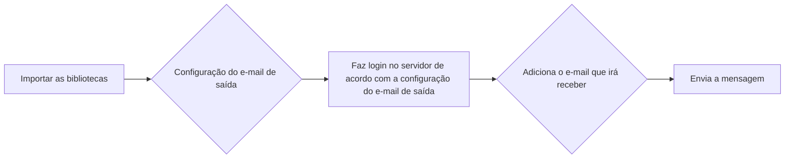

# Enviando um e-mail via Python

Esse repositório tem o intuito de ter um código que mande uma mensagem via e-mail, a partir de um e-mail para envio. O código foi feito usando um e-mail via outlook, no entanto, pode ser alterado por qualquer host e port que escolher.

## Diagrama do código

